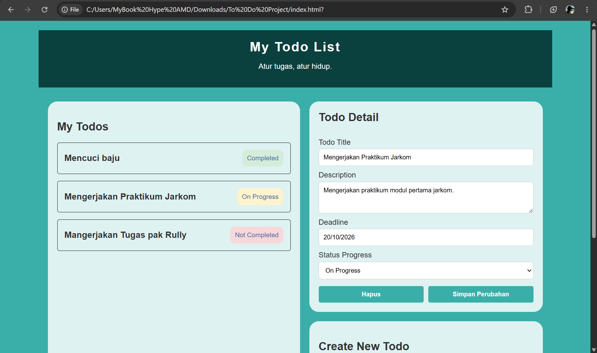
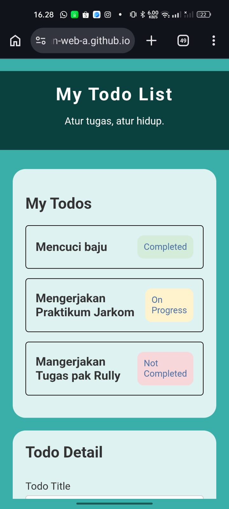

# [E01] The Style Warrior - ToDo App
## Identitas
- Nama : Najwan Sigit Cahya Buana
- NRP : 5025251031
- Kelas : Pemrograman Web (A)

## Deskripsi
Repositori ini berisi proyek pembuatan antarmuka pengguna statis untuk aplikasi Todo List yang dikembangkan menggunakan HTML dan CSS murni guna memenuhi tugas mata kuliah Pemrograman Web. Proyek ini menerapkan struktur elemen semantik HTML serta membagi tata letak konten menjadi dua panel utama menggunakan Flexbox atau Grid, di mana panel kiri menampilkan daftar tugas dan panel kanan memuat detail serta form pembuatan tugas baru. Selain itu, antarmuka ini dirancang agar responsif pada perangkat desktop maupun seluler serta menggunakan berkas eksternal `index.html` dan `style.css`. 

## Preview
### 1. Desktop Preview

### 2. Mobile Preview

