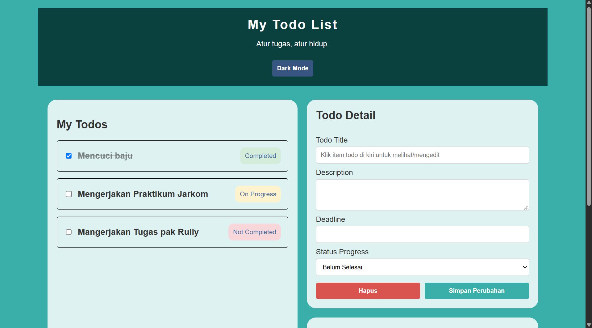
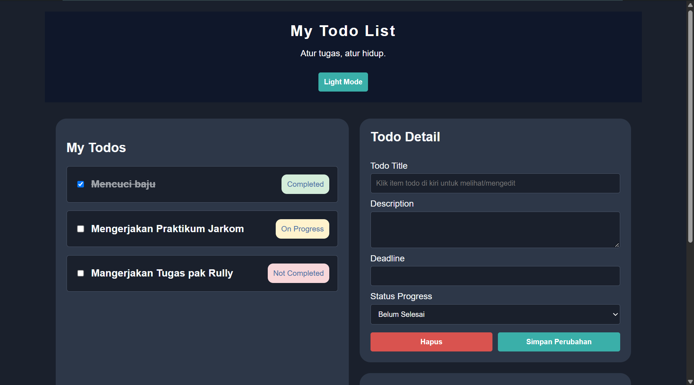
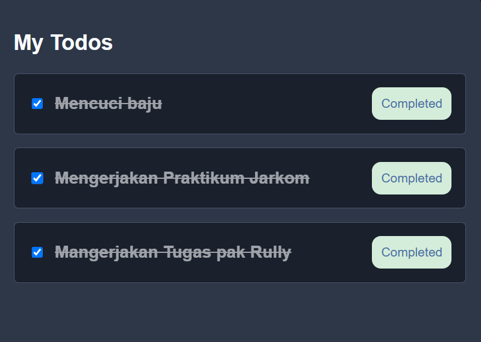
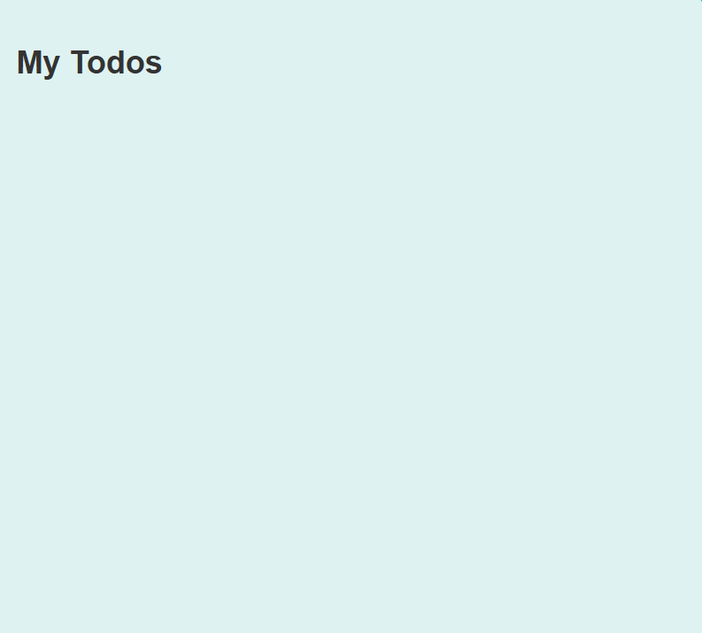
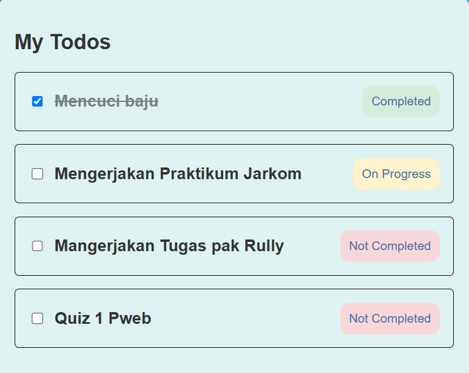

# [E01] The Style Warrior - ToDo App
## Identitas
- Nama : Najwan Sigit Cahya Buana
- NRP : 5025251031
- Kelas : Pemrograman Web (A)

## Deskripsi
Meneruskan website yang saya buat minggu sebelumnya, pada update ini ditambahkan versi javascript-nya. Dimana yang pertama ada fitur untuk mengubah light mode menjadi dark mode, disini saya juga membuat css baru untuk mode tersebut. Sekarang juga bisa melakukan penambahan, penghapusan dan pengeditan pada task yang ada. Selain itu saya menggunakan beberapa event handler guna menangkap input pengguna saat membuat daftar Todo baru. Hasilnya langsung muncul di layar detik itu juga berkat manipulasi DOM tanpa perlu memuat ulang halaman (zero-refresh). 

## Link Website
[LINK WEBSITE](https://if-pemrograman-web-a.github.io/5025251031_Todo-App/)

## Preview
### 1. Light Mode Preview

### 2. Dark Mode Preview

### 3. Completed Preview

### 4. Delete Task Preview

### 5. Add Task Preview

