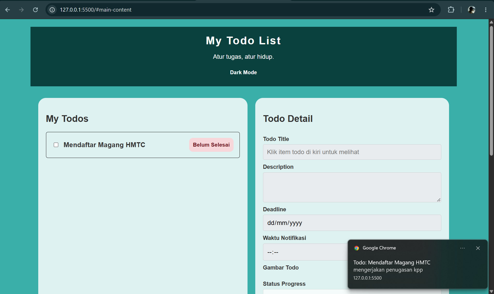
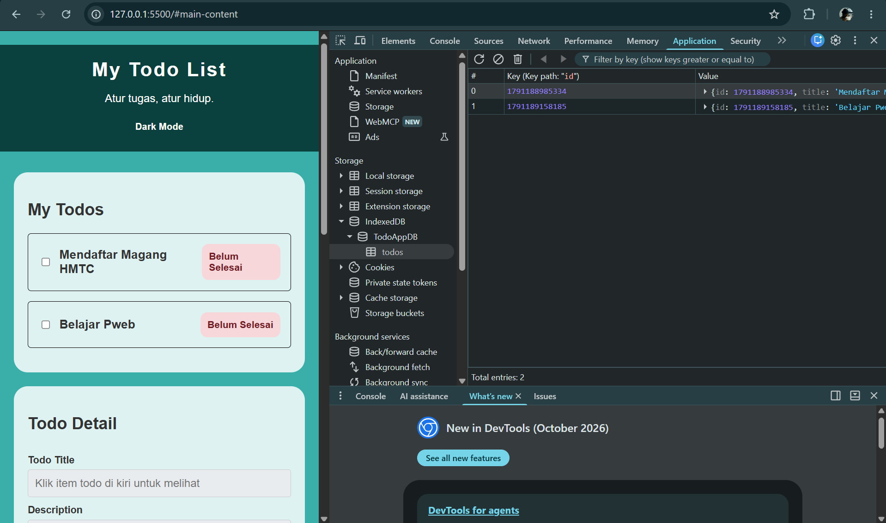
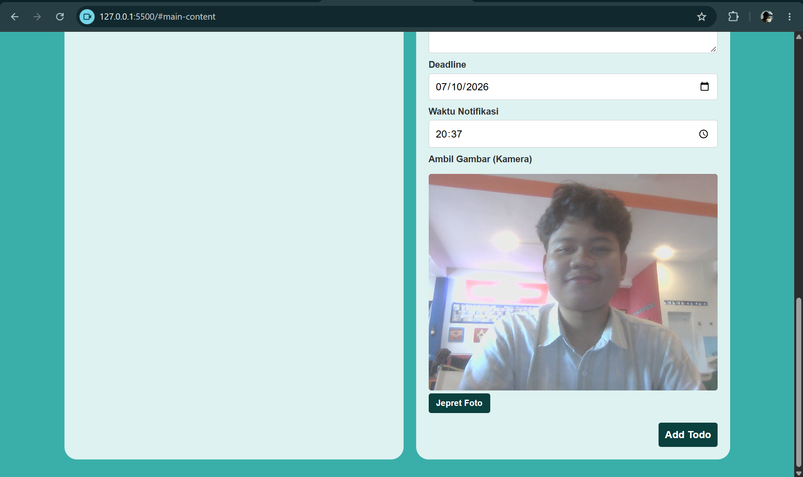
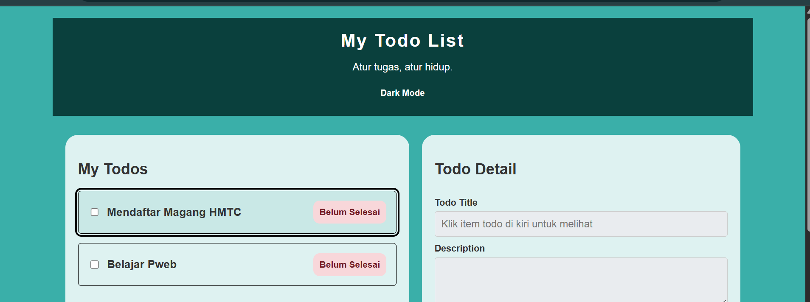
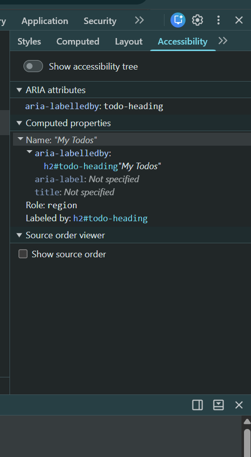

# [E03] The Style Warrior - ToDo App
## Identitas
- Nama : Najwan Sigit Cahya Buana
- NRP : 5025251031
- Kelas : Pemrograman Web (A)

## Deskripsi
Meneruskan tugas website Todo App dari minggu sebelumnya, pada update kali ini saya berfokus pada peningkatan fungsionalitas tingkat lanjut dan aksesibilitas. Pertama, saya mengimplementasikan Web Storage menggunakan IndexedDB untuk menyimpan data todo secara persisten di database browser, serta localStorage untuk menyimpan preferensi tema (Light/Dark mode) agar tidak hilang saat halaman dimuat ulang.   

Selanjutnya, saya mengintegrasikan Media Capture API yang memungkinkan pengguna untuk membuka kamera perangkat dan menjepret gambar secara langsung sebagai lampiran pada detail tugas. Aplikasi ini sekarang juga didukung oleh Service Worker dan Notification API yang berjalan di latar belakang, sehingga mampu memunculkan pop-up notifikasi pengingat tepat pada waktu yang disetel pengguna melalui form.   

Terakhir, saya menerapkan Accessibility pada seluruh komponen seperti dukungan navigasi keyboard menggunakan tabindex, penambahan atribut semantik dan label ARIA untuk screen reader, serta penyesuaian tipografi agar website ini lebih inklusif dan mudah diakses oleh semua kalangan pengguna.

## Link Website
[LINK WEBSITE](https://if-pemrograman-web-a.github.io/5025251031_Todo-App/)

## Preview
### 1. Notif Preview

### 2. IndexDB Preview

### 3. Kamera Preview

### 4. Focus Preview

### 4. ARIA Preview

